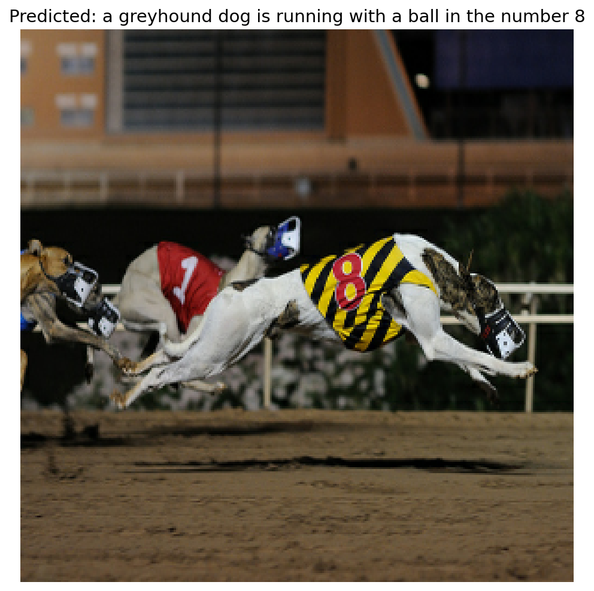
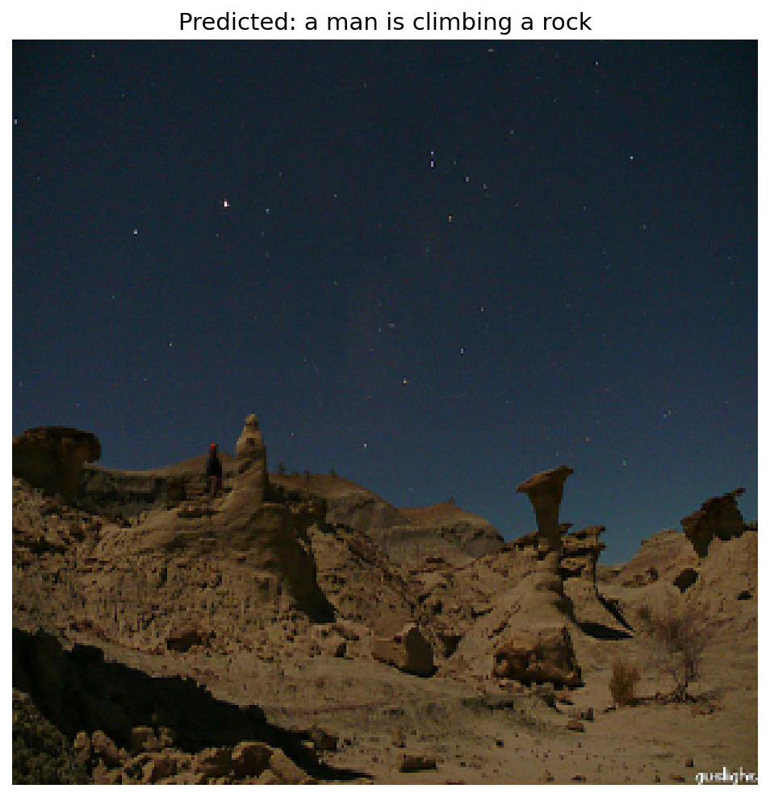
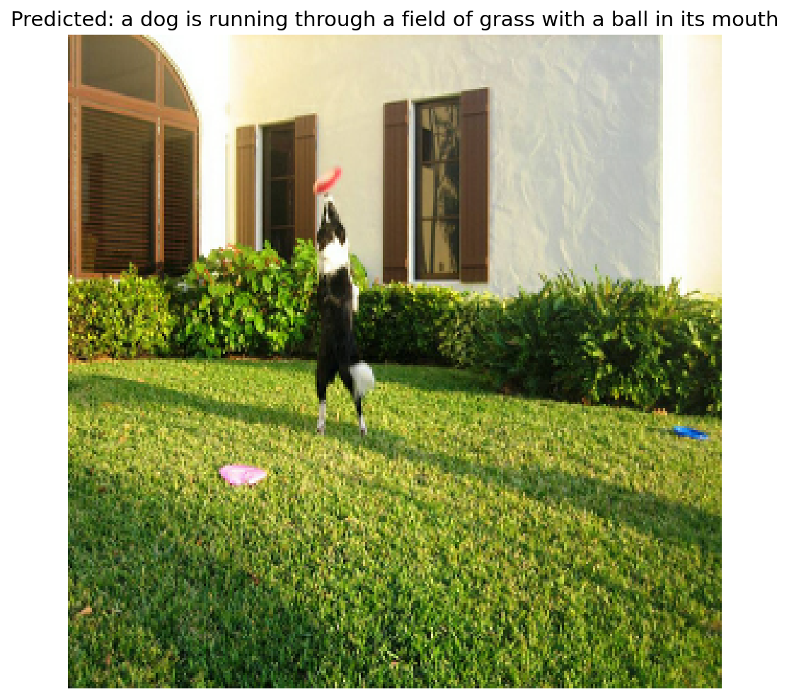
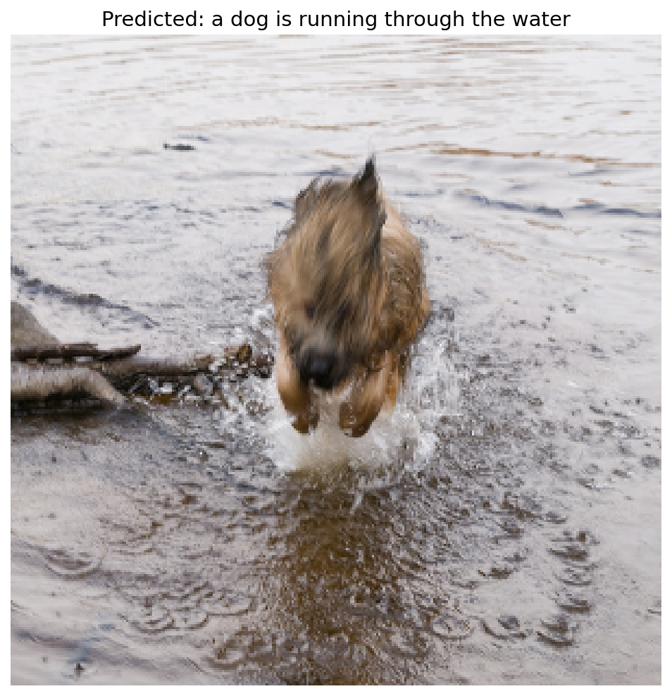
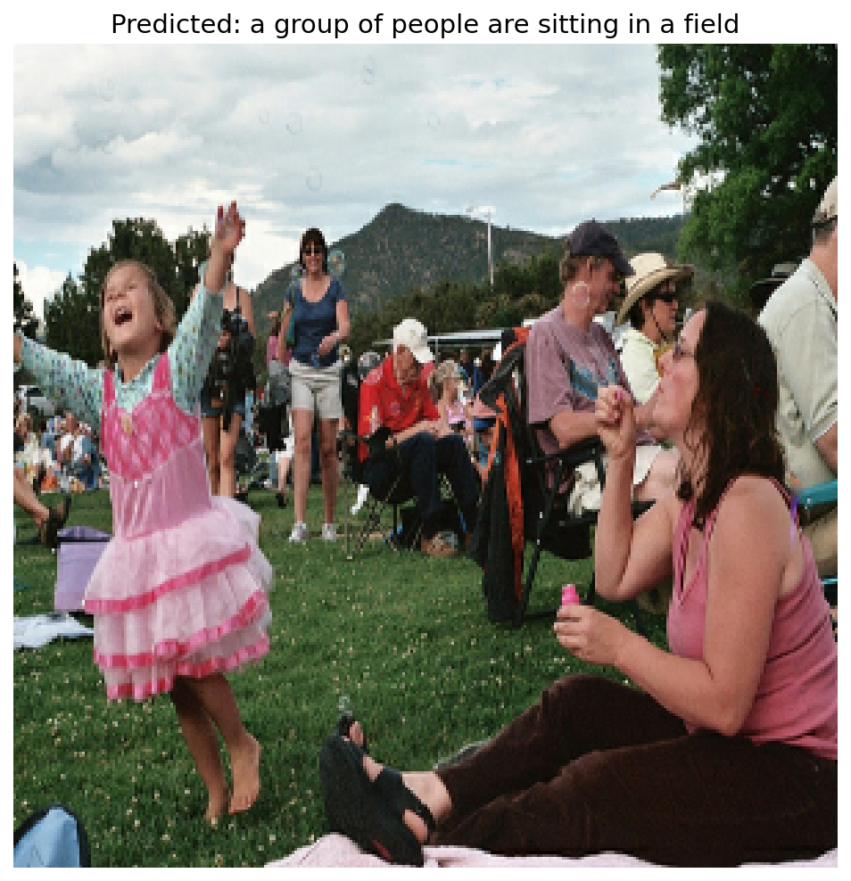

# Image Captioning with CNN + Transformer

A deep learning model that generates English-language captions for images, combining a frozen EfficientNetB0 visual encoder with a Transformer encoder–decoder text generator. Trained from scratch on the Flickr8k dataset.



*Predicted caption: "a greyhound dog is running with a ball in the number 8"*

## Architecture

The model consists of three components stacked together:

1. **CNN Visual Encoder** — A pretrained EfficientNetB0 (frozen, ImageNet weights) extracts a sequence of feature vectors from the input image. The classification head is removed; the spatial feature map is reshaped into a sequence the Transformer can consume.

2. **Transformer Encoder** — Refines the visual features with self-attention. Single block, single attention head. Pre-norm structure with a residual connection.

3. **Transformer Decoder** — Generates the caption autoregressively. Each step uses (a) causal self-attention over previously generated tokens, (b) cross-attention to the visual features from the encoder, and (c) a position-wise feed-forward network. Token + learned positional embeddings. Two attention heads.

Captions are decoded greedily — at each step the highest-probability token is selected.

## Dataset

[Flickr8k](https://www.kaggle.com/datasets/adityajn105/flickr8k): 8,000 images, each with 5 human-written captions. Images are diverse but skew heavily toward people and animals in action scenes. Train/validation split: 80/20.

Captions are preprocessed with `<start>` and `<end>` tokens, lowercased, and stripped of punctuation. Vocabulary capped at 10,000 tokens; sequences capped at 25 tokens. Captions shorter than 5 tokens or longer than 25 are filtered out.

## Training

| Setting | Value |
|---------|-------|
| Image size | 299 × 299 |
| Embedding dim | 512 |
| Feed-forward dim | 512 |
| Batch size | 64 |
| Epochs | 30 (early-stopped at 27) |
| Optimizer | Adam |
| Schedule | Linear warmup → constant 1e-4 |
| Hardware | NVIDIA T4 (Google Colab) |
| Time | ~50 minutes |

The training loop computes loss on all five captions per image (averaged), enabling the model to learn from the full annotation set rather than picking a single caption at random.

The training step uses a single `tf.GradientTape` context spanning all five caption losses, with one optimizer step per batch — a fix over an earlier version that incorrectly applied gradients five times per batch.

Image augmentation (horizontal flip, rotation, contrast) is applied during training but not at inference.

## Results

After 24 epochs (best epoch by validation loss), the model achieves:

- **Training accuracy:** ~47% token-level
- **Validation accuracy:** ~41% token-level
- **Validation loss:** 14.98

The model produces grammatically coherent English captions for most validation images. It captures common Flickr8k patterns well — dogs, people in groups, outdoor action scenes — and occasionally surprises with fine-grained detail (correctly identifying a racing greyhound and reading the number on its jersey, for example).

### Sample predictions

| Image | Predicted caption |
|-------|------------------|
|  | "a man is climbing a rock" |
|  | "a dog is running through a field of grass with a ball in its mouth" |
|  | "a dog is running through the water" |
|  | "a group of people are sitting in a field" |


## Repository Structure

```
Image-Captioning-Transformer/
├── src/
│   └── image_captioning.py       # Standalone training script
├── notebooks/
│   └── train_and_demo.ipynb      # Colab notebook (data download, train, predict)
├── images/                        # Sample prediction images
├── requirements.txt
├── LICENSE
├── .gitignore
└── README.md
```


## Known Limitations

- **Token accuracy of ~41% means roughly 6 of every 10 predicted tokens are wrong.** The model learns English grammar reliably but content correctness is approximate. Captions are best understood as a "general impression" of the scene rather than precise descriptions.

- **Greedy decoding produces repetitive and generic captions.** At each step the model picks the single highest-probability next token. Beam search (keeping the top-N candidate sequences) would produce more varied and accurate captions but was not implemented here.

- **Frozen visual encoder.** EfficientNetB0 was trained for ImageNet classification, not scene understanding. Fine-tuning the last few layers of the CNN on Flickr8k would meaningfully improve performance.

- **Small dataset.** Flickr8k has 8,000 images, ~6,400 in training. State-of-the-art image captioning models train on MSCOCO (120,000) or larger. The narrow distribution of Flickr8k images skews predictions toward dogs, people, and outdoor action scenes.

- **Mild overfitting.** Training loss continued to drop after validation loss plateaued at ~15.0. Early stopping (patience=3) caught this and restored the best weights.

- **Model size.** Single-head encoder, two-head decoder, single block of each. A 4-head, 3-block configuration would likely produce better captions but requires more compute.

## Future Work

In rough order of effort vs. impact:

- **Beam search decoding** — keep top-K candidate sequences and select the best overall. Low effort, noticeable improvement.
- **Fine-tune EfficientNetB0** — unfreeze the last 1-2 blocks and train at a lower learning rate. Medium effort, high impact.
- **Larger transformer** — 4 heads, 3 layers each in encoder and decoder. Medium effort, moderate impact.
- **Train on MSCOCO** — 15× more training data with broader scene diversity. High effort, high impact.
- **Caption evaluation metrics** — BLEU-4, METEOR, CIDEr scores against ground-truth captions instead of just token-level accuracy.
- **Attention visualization** — overlay decoder attention on the image to visualize which regions the model is "looking at" while generating each word.

## License

Released under the MIT License. See `LICENSE` for details.

## Acknowledgments

Architecture inspired by Vaswani et al., *Attention Is All You Need* (2017), and the encoder-decoder captioning approach from Vinyals et al., *Show and Tell* (2015), with the LSTM decoder replaced by a Transformer decoder. Implemented in TensorFlow / Keras.
